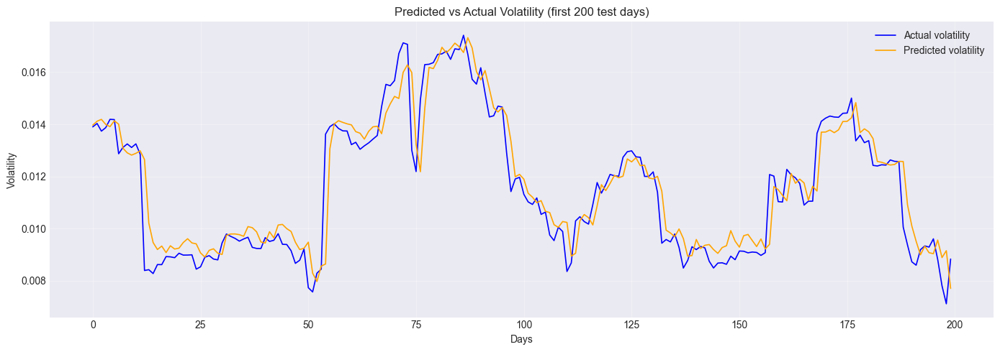
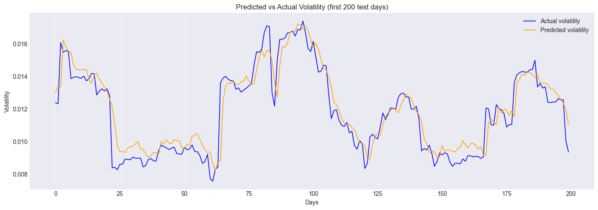

# 📈 AAPL Volatility Forecaster

A deep learning system for next-day volatility forecasting of Apple Inc. (AAPL) stock, comparing **LSTM** and **GRU** architectures, deployed as an interactive Streamlit dashboard.


---

## 🎯 Problem Statement

Volatility forecasting is one of the most important problems in quantitative finance. Unlike price prediction — which is nearly impossible due to market efficiency — volatility has a well-documented, exploitable property: **volatility clusters**.

> Calm days tend to follow calm days. Turbulent days tend to follow turbulent days.

This project predicts **tomorrow's realized volatility** (20-day rolling standard deviation of daily returns) for AAPL using two deep learning architectures: LSTM and GRU.

---

## 📊 Results

| Model | Relative Error | vs Persistence | Directional Hit Ratio |
|---|---|---|---|
| Naive persistence baseline | 9.63% | — | — |
| GARCH (industry standard) | 15–25% | — | — |
| **LSTM** | **9.55%** | **+0.08%** | **56.28%** |
| **GRU** | **9.48%** | **+0.15%** | **56.87%** |

**Key finding:** GRU outperforms LSTM on all metrics. This suggests that volatility clustering patterns don't require extremely long memory, making GRU's simpler gating mechanism a better fit for this problem. Both models significantly outperform GARCH.

### LSTM:


### GRU:


---

## 🏗️ Project Structure

```
├── model_training/
│   ├── model_building.ipynb      # full pipeline notebook
│   ├── functions.py             # contains all the functions i need
│   └── fine-tuning.ipynb
├── my_app.py                    # Streamlit dashboard
├── models/
│   ├── model_weights4.pth        # trained model weights (4 means version 4 ^_^)
│   └── scaler.pkl            # fitted feature scaler
├── README.md
├── requirements.txt
└── cached.csv  # contains a cached 3 years' volatility data, the program use it in case it could not load the latest data from yahoo finance
```

---

## ⚙️ Pipeline

```
yfinance (raw OHLCV — 16 years of AAPL data)
    ↓
Feature Engineering (17 features across 5 categories)
    ↓
Chronological Train/Val/Test Split (no shuffling)
    ↓
Sliding Window Dataset (W=60 for LSTM, W=50 for GRU)
    ↓
RobustScaler (fit on train only — no leakage)
    ↓
Model Training (quantile loss + early stopping + gradient clipping)
    ↓
Optuna Hyperparameter Tuning (50 trials per model, TPE sampler)
    ↓
Evaluation (RMSE + relative error + directional hit ratio)
    ↓
Streamlit Dashboard (live predictions from yfinance)
```

---

## 🔧 Features (17 total)

| Category | Features |
|---|---|
| Returns & lags | return, lag1, lag5, lag10 |
| Price-based | ma10, ma50, price_vs_ma50, high_low_range |
| Volatility | volatility5, volatility10, volatility20, volatility60, vol_ratio |
| Technical indicators | rsi, macd |
| Volume | volume_change, volume_ratio |

---

## 🧠 Model Architectures

### LSTM

```
Input (batch, 60, 17)
    ↓
LSTM Layer 1 (hidden=64)
    ↓
LSTM Layer 2 (hidden=64)
    ↓
Dropout (p=0.134)
    ↓
Linear (64 → 1)
    ↓
Predicted volatility
```

### GRU

```
Input (batch, 50, 17)
    ↓
GRU Layer 1 (hidden=256)
    ↓
GRU Layer 2 (hidden=256)
    ↓
GRU Layer 3 (hidden=256)
    ↓
GRU Layer 4 (hidden=256)
    ↓
Dropout (p=0.505)
    ↓
Linear (256 → 1)
    ↓
Predicted volatility
```

---

## ⚡ Best Hyperparameters (found by Optuna)

### LSTM

| Parameter | Value |
|---|---|
| Window size (W) | 60 days |
| Hidden size | 64 |
| Num layers | 2 |
| Dropout | 0.134 |
| Learning rate | 0.00207 |
| Batch size | 48 |
| Patience | 23 |
| Quantile (loss) | 0.618 |

### GRU

| Parameter | Value |
|---|---|
| Window size (W) | 50 days |
| Hidden size | 256 |
| Num layers | 4 |
| Dropout | 0.505 |
| Learning rate | 0.00142 |
| Batch size | 32 |
| Patience | 20 |
| Quantile (loss) | 0.641 |

---

## 🔬 Methodology Notes

### Why volatility, not price?

Price prediction is extremely hard — markets are semi-efficient and all public information is already priced in. Volatility, however, has a well-documented autocorrelation structure (volatility clustering) that makes it genuinely forecastable.

### Why chronological split?

Financial time series must be split chronologically. Shuffling would leak future information into training, producing artificially optimistic results that don't hold in real deployment.

### Why quantile loss?

MSE penalizes over and underprediction equally. In risk management, **underestimating volatility is more costly** than overestimating it. Quantile loss with q > 0.5 asymmetrically penalizes underprediction, pushing the model to better capture volatility spikes.

### Why Optuna over GridSearch?

GridSearch exhaustively tries all combinations — prohibitively expensive for deep learning. Optuna uses Tree-structured Parzen Estimator (TPE) which learns from previous trials and focuses on promising hyperparameter regions. MedianPruner cuts unpromising trials early, saving significant compute time.

### Why does GRU beat LSTM here?

GRU has fewer parameters (2 gates vs 3) and shorter effective memory. For volatility clustering — where the relevant pattern is "is the market currently calm or turbulent?" — recent context matters more than long-term memory. GRU's simpler architecture is a better fit for this specific signal structure.

---

## 📈 Improvement Journey

| Stage | Relative Error |
|---|---|
| First LSTM attempt | ~17% |
| Manual tuning (dropout, patience) | 14.86% |
| Optuna tuning | 12.84% |
| More training data (tr + val) | 11.55% |
| Quantile loss (q=0.68) | 10.26% |
| W optimization via Optuna | 9.61% |
| Final LSTM | 9.55% |
| **Final GRU** | **9.48%** |

---

## 🚀 Running the App

### Install dependencies

```bash
pip install torch yfinance streamlit pandas numpy scikit-learn ta joblib matplotlib optuna
```

### Run the dashboard

```bash
streamlit run app.py
```

The app automatically fetches the latest AAPL data from Yahoo Finance — no manual upload needed.

---

## 📱 Dashboard Features

- **Live data** — fetches latest AAPL prices automatically on demand
- **Risk badge** — Low / Medium / High based on predicted vs historical mean volatility
- **Interactive chart** — historical volatility curve + tomorrow's prediction point
- **Date range slider** — 30 to 365 days of historical context
- **Model metrics** — RMSE, relative error, and comparison vs baselines in sidebar

---

## 🛠️ Tech Stack

| Tool | Purpose |
|---|---|
| PyTorch | LSTM and GRU models |
| yfinance | Market data (OHLCV) |
| scikit-learn | Preprocessing (RobustScaler) |
| ta | Technical indicators (RSI, MACD) |
| Optuna | Hyperparameter tuning (TPE + MedianPruner) |
| Streamlit | Interactive dashboard |
| Matplotlib | Visualization |

---

## 🔮 Future Work

- Weekly automated retraining pipeline
- GARCH-LSTM hybrid model (use GARCH residuals as LSTM features)
- Multi-stock generalization
- Confidence intervals around predictions
- News sentiment features using FinBERT
- Formal GARCH comparison using statsmodels
- Backtesting with transaction costs

---

## 👤 Author

**Guettara Mohamed Amine**
4th year AI Engineering student — Université Mouloud Mammeri de Tizi-Ouzou (UMMTO), Algeria

---

## ⚠️ Disclaimer

This project is for educational and research purposes only. It is not financial advice. Do not make investment decisions based on this model's predictions.