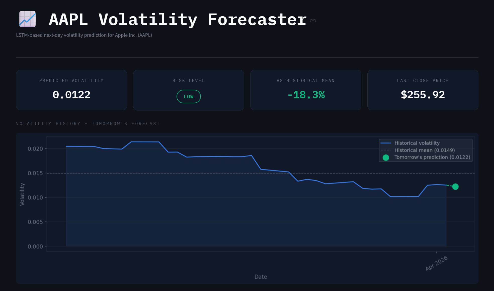
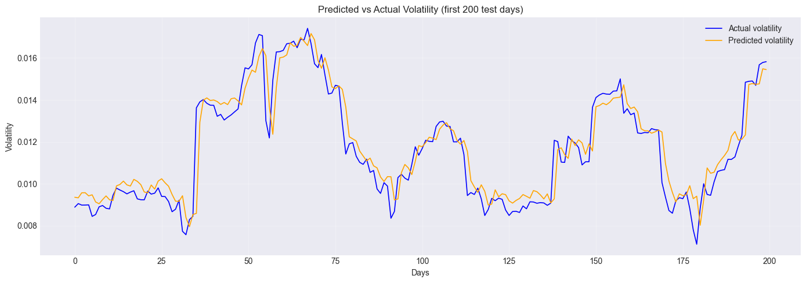

# 📈 AAPL Volatility Forecaster

A deep learning system for next-day volatility forecasting of Apple Inc. (AAPL) stock, built with PyTorch and deployed as an interactive Streamlit dashboard.



---

## 🎯 Problem Statement

Volatility forecasting is one of the most important problems in quantitative finance. Unlike price prediction, volatility forecasting has a strong, documented signal — **volatility clusters**: calm days tend to follow calm days, and turbulent days tend to follow turbulent days.

This project predicts **tomorrow's realized volatility** (20-day rolling standard deviation of daily returns) for AAPL using a stacked LSTM neural network.

---

## 📊 Results

| Model | Relative Error |
|---|---|
| Naive persistence baseline | ~17% |
| GARCH benchmark (industry standard) | 15–25% |
| **This LSTM model** | **9.61%** |

The model beats both the naive persistence baseline and the classical GARCH model, which has been the industry standard since 1986.



---

## 🏗️ Project Structure

```
├── model_training/
│   └── model_building.ipynb      # full pipeline notebook
├── my_app.py                    # Streamlit dashboard
├── models/
│   ├── model_weights4.pth        # trained model weights (4 means version 4 ^_^)
│   └── scaler.pkl            # fitted feature scaler
└── README.md
```

---

## ⚙️ Pipeline

```
yfinance (raw OHLCV)
    ↓
Feature Engineering (16 features)
    ↓
Chronological Train/Test Split (80/20)
    ↓
Sliding Window Dataset (W=90 days)
    ↓
RobustScaler (fit on train only)
    ↓
LSTM Training (quantile loss, early stopping)
    ↓
Optuna Hyperparameter Tuning (100 trials)
    ↓
Evaluation (RMSE + relative error)
    ↓
Streamlit Dashboard
```

---

## 🔧 Features (16 total)

| Category | Features |
|---|---|
| Returns & lags | return, lag1, lag5, lag10 |
| Price-based | ma10, ma50, price_vs_ma50, high_low_range |
| Volatility | volatility5, volatility10, volatility20, volatility60, vol_ratio |
| Technical | rsi, macd |
| Volume | volume_ratio, volume_change |

---

## 🧠 Model Architecture

```
Input (batch, 90, 16)
    ↓
LSTM Layer 1 (hidden=256)
    ↓
LSTM Layer 2 (hidden=256)
    ↓
Dropout (p=0.256)
    ↓
Linear (256 → 1)
    ↓
ReLU (ensures positive output)
    ↓
Predicted volatility
```

**Best hyperparameters (found by Optuna):**

| Parameter | Value |
|---|---|
| Window size (W) | 90 days |
| Hidden size | 256 |
| Num layers | 2 |
| Dropout | 0.2559 |
| Learning rate | 0.00145 |
| Batch size | 64 |
| Patience | 21 |
| Loss function | Quantile loss (q=0.68) |

The quantile loss with q=0.68 was chosen deliberately — it asymmetrically penalizes underprediction of volatility spikes, which is more costly than overprediction in a risk management context.

---

## 🚀 Running the App

### Install dependencies

```bash
pip install torch yfinance streamlit pandas numpy scikit-learn ta joblib matplotlib optuna
```

### Run the dashboard

```bash
streamlit run my_app.py
```

The app automatically fetches the latest AAPL data from Yahoo Finance — no manual data upload needed.

---

## 📱 Dashboard Features

- **Live data** — fetches latest AAPL prices automatically
- **Risk badge** — Low / Medium / High based on predicted vs historical mean
- **Interactive chart** — historical volatility + tomorrow's prediction
- **Date range slider** — 30 to 365 days of history
- **Model metrics** — displayed in sidebar for transparency

---

## 🔬 Methodology Notes

### Why volatility, not price?

Price prediction is extremely hard because markets are semi-efficient — all public information is already priced in. Volatility, however, has a well-documented autocorrelation structure that makes it genuinely forecastable.

### Why chronological split?

Unlike tabular datasets, financial time series must be split chronologically — shuffling would leak future information into training, producing artificially optimistic results.

### Why quantile loss?

MSE treats over and underprediction symmetrically. In risk management, **underestimating volatility is more costly** than overestimating it — a missed spike can lead to unhedged exposure. Quantile loss with q=0.68 penalizes underprediction more heavily, pushing the model to better capture volatility spikes.

### Why Optuna over GridSearch?

GridSearch exhaustively tries all combinations — computationally expensive for deep learning. Optuna uses Tree-structured Parzen Estimator (TPE) which learns from previous trials and focuses the search on promising regions of the hyperparameter space.

---

## 📈 Improvement Journey

| Stage | Relative Error |
|---|---|
| First LSTM attempt | ~17% |
| Manual tuning (dropout, patience) | 14.86% |
| Optuna hyperparameter search | 12.84% |
| More training data (tr + val) | 11.55% |
| Quantile loss (q=0.68) | 10.26% |
| W optimization via Optuna | **9.61%** |

---

## 🔮 Future Work

- Weekly automated retraining pipeline
- Multi-stock generalization
- Confidence intervals around predictions
- News sentiment features (FinBERT)
- Formal GARCH comparison using statsmodels
- Backtesting with transaction costs

---

## 🛠️ Tech Stack

| Tool | Purpose |
|---|---|
| PyTorch | LSTM model |
| yfinance | Market data |
| scikit-learn | Preprocessing |
| ta | Technical indicators |
| Optuna | Hyperparameter tuning |
| Streamlit | Dashboard |
| Matplotlib | Visualization |

---

## 👤 Author

**Guettara Mohamed Amine**
4th year AI Engineering student — Université Mouloud Mammeri de Tizi-Ouzou (UMMTO), Algeria

---

## ⚠️ Disclaimer

This project is for educational and research purposes only. It is not financial advice. Do not make investment decisions based on this model's predictions.
